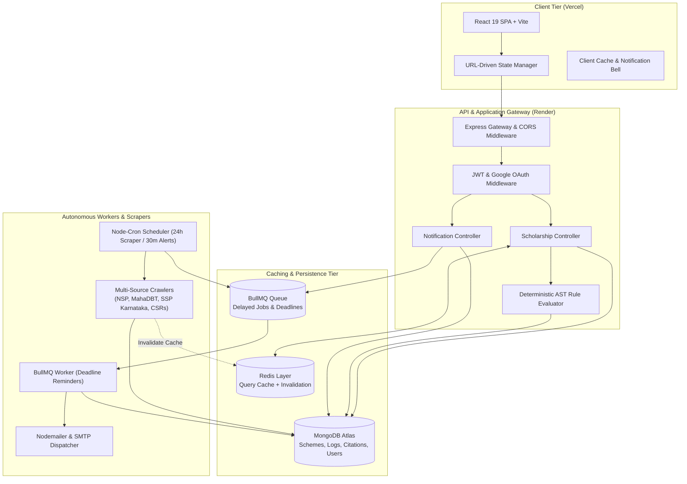
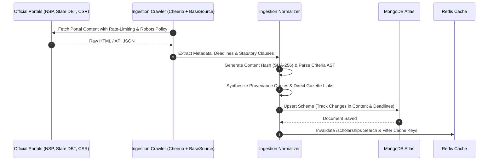
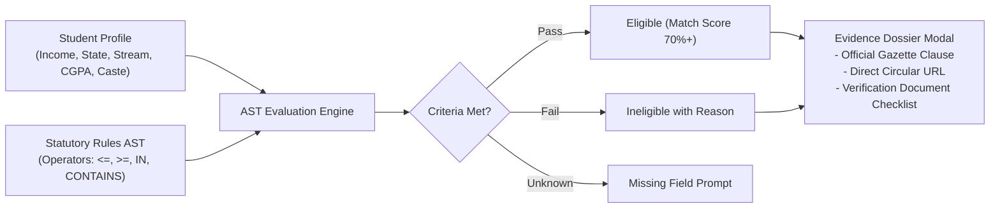
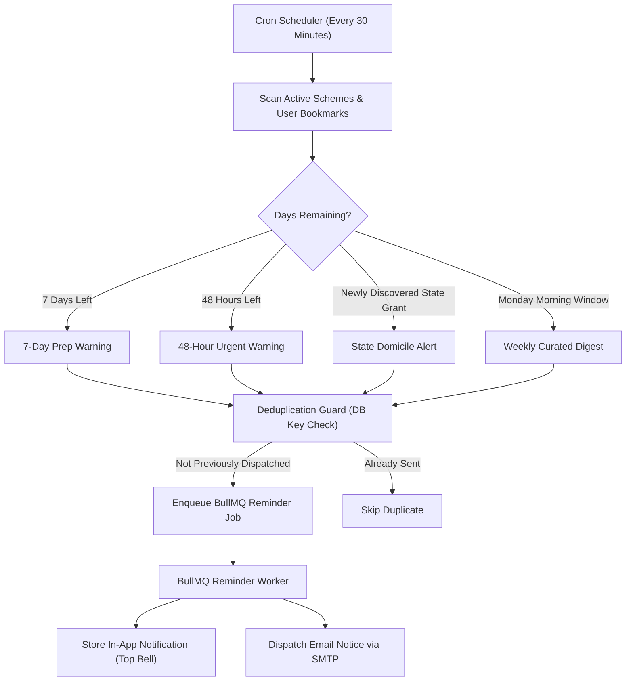

# Udaan Scholarship Finder

[](https://udaan-scholarships.vercel.app/)
[](https://udaan-scholarship-finder.onrender.com)
[](https://nodejs.org/)
[](https://react.dev/)
[](https://www.mongodb.com/)
[](https://redis.io/)

Udaan is an autonomous scholarship intelligence platform built for Indian students. It bridges the gap between decentralized government portals and eligible applicants by continuously crawling statutory circulars, parsing eligibility rules into deterministic Abstract Syntax Trees (ASTs), evaluating student qualifications with gazette citations, and dispatching multi-channel deadline alerts.

---

## 1. System Architecture

Udaan follows a decoupled, service-oriented architecture designed for high availability, fast search queries, and resilient background task processing.



---

## 2. Core Pipelines & Engineering Workflows

### A. Ingestion & Regulatory Citation Pipeline
Unlike generic scrapers that extract unstructured text, Udaan normalizes all ingested schemes into an AST of atomic conditions linked to official circulars and gazette citations.



### B. Eligibility & Statutory Verification Engine
Rather than relying on probabilistic AI guesses that produce hallucinations, Udaan uses a deterministic evaluation engine to verify student qualifications against statutory criteria.



### C. BullMQ Background Task & Deadline Notification Flow
Deadlines are monitored continuously to prevent students from missing application windows.



---

## 3. Key Features

| Feature | Description | Technical Implementation |
| :--- | :--- | :--- |
| **Instant Multivariable Search** | Search through tens of thousands of grants by name, issuing ministry, level, and category. | Debounced single-source-of-truth URL params synced with Redis cached MongoDB queries. |
| **AST Criteria Engine** | Verifies eligibility against income ceilings, domicile, minimum CGPA, gender, and minority categories. | Recursive Abstract Syntax Tree evaluator (`ruleEvaluator.js`) with zero AI hallucinations. |
| **Regulatory Evidence Dossier** | View exact gazette directive quotes, official issuing authorities, and required certificates for each scheme. | Automatic provenance extraction in `BaseSource.js` and rendered via interactive `EvidenceModal.jsx`. |
| **Upcoming Deadline Reminders** | Proactive alerts dispatched automatically 7 days and 48 hours before portals close. | Node-cron scanner + BullMQ worker queue with deduplication guards. |
| **State Grant Circular Alerts** | Notifies students when newly discovered state schemes are announced for their domicile. | Event-driven notification generator triggered by crawler upserts. |
| **Weekly Curated Digest** | Personalized summary delivered every Monday morning highlighting schemes closing that week. | Timezone-aware cron job targeting active matching profiles. |
| **Interactive In-App Notification Center** | Real-time notification drawer with unread badges, filter tabs, and mark-as-read controls. | Custom poll manager with guest simulation fallback and 401 recovery interceptors. |
| **Student Preference Vault** | Configure minimum match score threshold, alert frequencies, delivery channels, and academic parameters. | REST endpoints (`/api/notifications/preferences`) with fallback to local session for guests. |

---

## 4. Tech Stack Breakdown

### Frontend
* **Framework**: React 19 SPA powered by Vite
* **Styling**: Tailwind CSS v4, custom Valley Sans and Newsreader typography
* **Icons**: Lucide React
* **Toasts & Feedback**: Sonner
* **Routing**: React Router v7 with URL search parameters as Single Source of Truth

### Backend
* **Runtime**: Node.js (ES Modules)
* **Framework**: Express.js with CORS gateway
* **Database**: MongoDB Atlas with Mongoose ODM
* **Caching**: Redis via `ioredis` (with automatic in-memory fallback)
* **Queues & Scheduling**: BullMQ worker queues + `node-cron`
* **Crawling & Parsing**: Cheerio, Axios, robots-parser

---

## 5. Getting Started Locally

### Prerequisites
* Node.js v18.0.0 or higher
* npm or yarn
* Local or cloud MongoDB connection string
* Optional: Local or Upstash Redis instance (backend gracefully falls back if Redis is not present)

### 1. Clone the Repository
```bash
git clone https://github.com/sanskriti49/udaan-scholarship-finder.git
cd udaan-scholarship-finder
```

### 2. Configure Backend Environment
Create a `.env` file inside the `backend/` directory:
```env
PORT=5000
NODE_ENV=development
MONGO_URI=your_mongodb_connection_string
JWT_SECRET=your_secure_jwt_secret
REDIS_URL=redis://127.0.0.1:6379
FRONTEND_URL=http://localhost:5173

# Optional SMTP Configuration for Live Email Delivery
SMTP_HOST=smtp.gmail.com
SMTP_PORT=587
SMTP_USER=your_email@gmail.com
SMTP_PASS=your_app_specific_password
EMAIL_FROM=notifications@udaan.org
```

### 3. Install Dependencies & Start Backend
```bash
cd backend
npm install
npm start
```
The backend server will start on `http://localhost:5000`.

### 4. Configure Frontend Environment & Start
Open a new terminal window:
```bash
cd frontend
npm install
npm run dev
```
Open `http://localhost:5173` in your browser to explore Udaan.

---

## 6. Directory Layout

```
udaan-scholarship-finder/
├── backend/
│   ├── src/
│   │   ├── config/              # MongoDB and Redis connection clients
│   │   ├── controllers/         # REST API endpoints (scholarships, auth, notifications)
│   │   ├── engine/              # AST rule evaluator and citation resolver
│   │   ├── ingestion/           # Portal crawlers (NSP, MahaDBT, SSP, BaseSource)
│   │   ├── middlewares/         # JWT authentication and error handlers
│   │   ├── models/              # Mongoose schemas (Scholarship, User, Notification, Log)
│   │   ├── queues/              # BullMQ queue definitions and reminder workers
│   │   ├── routes/              # Express API routers
│   │   ├── schedulers/          # Cron jobs for automated crawling and deadline alerts
│   │   └── services/            # Cache, email, and notification business logic
│   ├── server.js                # Express app entrypoint
│   └── package.json
├── frontend/
│   ├── src/
│   │   ├── assets/              # Fonts, branding logos, and illustrations
│   │   ├── components/          # EvidenceModal, NotificationCenter, Navbar, Footer
│   │   ├── context/             # AuthContext with automatic 401 token invalidation
│   │   ├── layouts/             # Mainlayout with smooth navigation transitions
│   │   ├── pages/               # Home, Scholarships, Eligibility, Settings, Support
│   │   ├── services/            # Axios API client and data service hooks
│   │   └── App.jsx              # Route provider
│   ├── vite.config.js
│   └── package.json
└── README.md
```

---

## 7. License & Credits
Built for student empowerment across India. Custom fonts (Clash Display, Satoshi, Valley Sans) are property of their respective creators and distributed under the Free Font License (FFL.txt). All government circular references belong to their respective issuing ministries and portal authorities.
