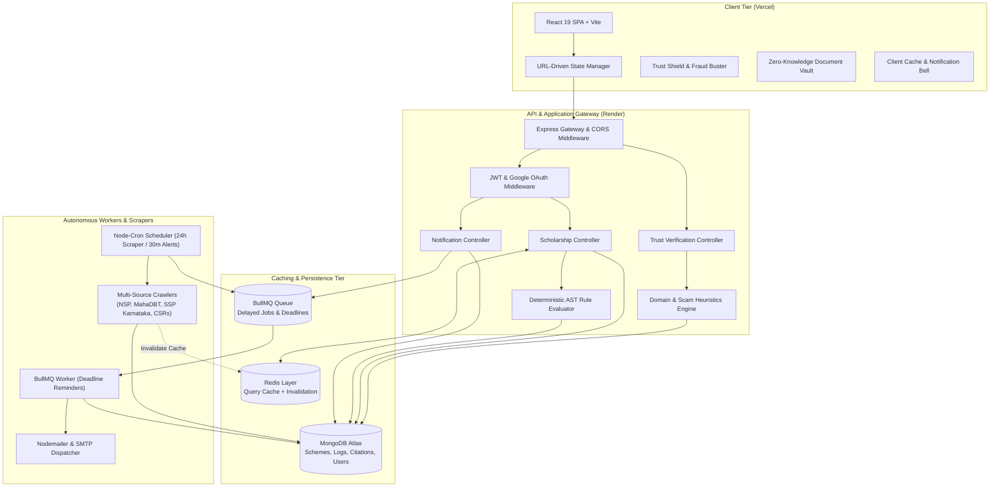
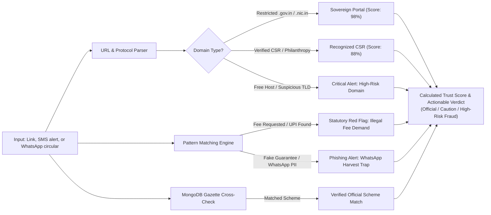
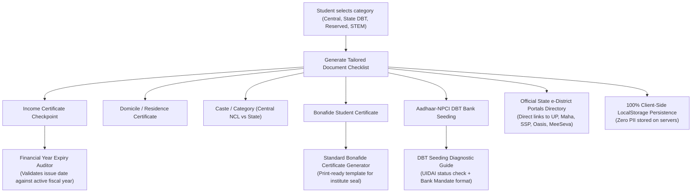
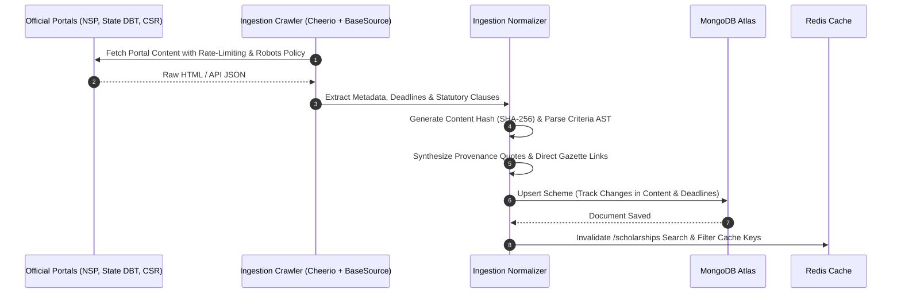
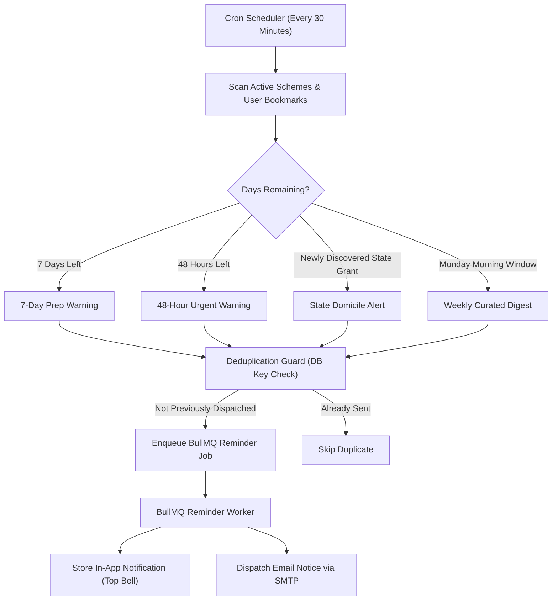

# Udaan Scholarship Finder

[](https://udaan-scholarships.vercel.app/)
[](https://udaan-scholarship-finder.onrender.com)
[](https://nodejs.org/)
[](https://react.dev/)
[](https://www.mongodb.com/)
[](https://redis.io/)

Udaan is an autonomous scholarship intelligence and trust platform built for Indian students. It bridges the gap between decentralized government portals and eligible applicants by continuously crawling statutory circulars, verifying portal legitimacy, auditing document readiness with zero PII storage, parsing eligibility rules into deterministic Abstract Syntax Trees (ASTs), and dispatching multi-channel deadline countdowns.

---

## 1. System Architecture

Udaan follows a decoupled, service-oriented architecture designed for high availability, sub-second search queries, zero-knowledge privacy, and resilient background task processing.



---

## 2. Core Pipelines & Engineering Workflows

### A. Anti-Scam & Trust Verification Shield
Over 30% of scholarship circulars circulating on social media are phishing scams demanding application fees. Udaan provides an autonomous link and message analyzer backed by domain authority checks and statutory gazette registries.



### B. Zero-Knowledge Document Readiness & Expiry Audit
Over 40% of genuine scholarship applications get rejected because of expired certificates or unseeded bank accounts. Udaan provides an interactive readiness audit without ever asking for, uploading, or storing sensitive government IDs.



### C. Ingestion & Regulatory Citation Pipeline
Unlike generic scrapers that extract unstructured text, Udaan normalizes all ingested schemes into an AST of atomic conditions linked to official circulars and gazette citations.



### D. BullMQ Background Task & Deadline Notification Flow
Deadlines are monitored continuously to prevent students from missing application windows.



---

## 3. Key Features Matrix

| Feature | Description | Technical Implementation |
| :--- | :--- | :--- |
| **Anti-Scam & Trust Shield** | Verify external scholarship links, forwards, and circulars for application fees and fraudulent lookalike domains. | Autonomous heuristic engine (`trustVerificationService.js`) + official domain whitelist. |
| **Zero-Knowledge Document Vault** | Complete certificate readiness checklist customized by category with zero document uploads or server storage. | 100% client-side privacy model with `localStorage` state caching. |
| **Financial Year Expiry Auditor** | Evaluates certificate issue date against the active Indian fiscal year (April 1 to March 31) to prevent rejection. | In-browser date calculation against statutory fiscal cycles. |
| **Aadhaar-NPCI DBT Diagnostics** | Step-by-step self-test to verify whether student bank accounts are mapped to NPCI for PFMS grant disbursement. | Interactive self-diagnosis tool + standardized Bank Mandate format. |
| **Printable Bonafide Generator** | Generates standardized, print-ready Bonafide Certificates adhering to AICTE/UGC specifications for college signature. | Client-side dynamic template generator with native print layout. |
| **State e-District Directory** | Direct links to official state portals for Income, Domicile, and Caste certificate renewals. | Curated directory of 10+ sovereign state portals (UP, MahaDBT, SSP, MeeSeva, Oasis). |
| **Deterministic AST Criteria Engine** | Verifies eligibility against income ceilings, domicile, minimum CGPA, gender, and minority categories. | Recursive Abstract Syntax Tree evaluator (`ruleEvaluator.js`) with zero AI hallucinations. |
| **Regulatory Evidence Dossier** | View exact gazette directive quotes, official issuing authorities, and required certificates for each scheme. | Automatic provenance extraction in `BaseSource.js` and rendered via interactive `EvidenceModal.jsx`. |
| **Upcoming Deadline Reminders** | Proactive alerts dispatched automatically 7 days and 48 hours before portals close. | Node-cron scanner + BullMQ worker queue with deduplication guards. |
| **Interactive Notification Center** | Real-time notification drawer with unread badges, filter tabs, guest preview mode, and mark-as-read controls. | Custom poll manager with guest simulation fallback and 401 recovery interceptors. |

---

## 4. Privacy & Security Architecture

Trust is foundational when dealing with educational opportunities:

1. **Zero Government ID Storage**: Udaan never requests, uploads, or stores Aadhaar numbers, PAN cards, or raw certificate scans.
2. **Metadata-Only Verification**: The Document Vault operates purely on structured validation checkpoints (e.g., issue dates, issuing authority type, digital barcode presence).
3. **Local-First Privacy**: Personal checklist statuses are saved exclusively in browser `localStorage`, leaving zero digital footprint on backend databases.
4. **Zero Application Fee Guarantee**: Udaan explicitly enforces and educates students on statutory laws prohibiting application fees for government and recognized CSR scholarships.

---

## 5. Tech Stack Breakdown

### Frontend
* **Framework**: React 19 SPA powered by Vite
* **Styling**: Tailwind CSS v4, custom Valley Sans and Newsreader typography
* **Icons**: Lucide React
* **Toasts & Feedback**: Sonner
* **Routing**: React Router v7 with URL search parameters as Single Source of Truth

### Backend
* **Runtime**: Node.js (ES Modules)
* **Framework**: Express.js with CORS gateway
* **Database**: MongoDB Atlas with Mongoose ODM
* **Caching**: Redis via `ioredis` (with automatic in-memory fallback)
* **Queues & Scheduling**: BullMQ worker queues + `node-cron`
* **Crawling & Verification**: Cheerio, Axios, URL domain heuristics

---

## 6. Getting Started Locally

### Prerequisites
* Node.js v18.0.0 or higher
* npm or yarn
* Local or cloud MongoDB connection string
* Optional: Local or Upstash Redis instance (backend gracefully falls back if Redis is not present)

### 1. Clone the Repository
```bash
git clone https://github.com/sanskriti49/udaan-scholarship-finder.git
cd udaan-scholarship-finder
```

### 2. Configure Backend Environment
Create a `.env` file inside the `backend/` directory:
```env
PORT=5000
NODE_ENV=development
MONGO_URI=your_mongodb_connection_string
JWT_SECRET=your_secure_jwt_secret
REDIS_URL=redis://127.0.0.1:6379
FRONTEND_URL=http://localhost:5173

# Optional SMTP Configuration for Live Email Delivery
SMTP_HOST=smtp.gmail.com
SMTP_PORT=587
SMTP_USER=your_email@gmail.com
SMTP_PASS=your_app_specific_password
EMAIL_FROM=notifications@udaan.org
```

### 3. Install Dependencies & Start Backend
```bash
cd backend
npm install
npm start
```
The backend server will start on `http://localhost:5000`.

### 4. Configure Frontend Environment & Start
Open a new terminal window:
```bash
cd frontend
npm install
npm run dev
```
Open `http://localhost:5173` in your browser to explore Udaan.

---

## 7. Directory Layout

```
udaan-scholarship-finder/
├── backend/
│   ├── src/
│   │   ├── config/              # MongoDB and Redis connection clients
│   │   ├── controllers/         # REST API endpoints (scholarships, auth, notifications, verify)
│   │   ├── engine/              # AST rule evaluator and citation resolver
│   │   ├── ingestion/           # Portal crawlers (NSP, MahaDBT, SSP, BaseSource)
│   │   ├── middlewares/         # JWT authentication and error handlers
│   │   ├── models/              # Mongoose schemas (Scholarship, User, Notification, Log)
│   │   ├── queues/              # BullMQ queue definitions and reminder workers
│   │   ├── routes/              # Express API routers (scholarships, auth, notifications, verify)
│   │   ├── schedulers/          # Cron jobs for automated crawling and deadline alerts
│   │   └── services/            # Cache, email, notification, and trustVerification logic
│   ├── server.js                # Express app entrypoint
│   └── package.json
├── frontend/
│   ├── src/
│   │   ├── assets/              # Fonts, branding logos, and illustrations
│   │   ├── components/          # EvidenceModal, NotificationCenter, Navbar, Footer
│   │   ├── context/             # AuthContext with automatic 401 token invalidation
│   │   ├── layouts/             # Mainlayout with smooth navigation transitions
│   │   ├── pages/               # Home, Scholarships, Eligibility, TrustShield, DocumentVault, Settings, Support
│   │   ├── services/            # Axios API client, scholarshipService, verifyService
│   │   └── App.jsx              # Route provider
│   ├── vite.config.js
│   └── package.json
└── README.md
```

---

## 8. License & Credits
Built for student empowerment and safety across India. Custom fonts (Clash Display, Satoshi, Valley Sans) are property of their respective creators and distributed under the Free Font License (FFL.txt). All government circular references belong to their respective issuing ministries and portal authorities.
