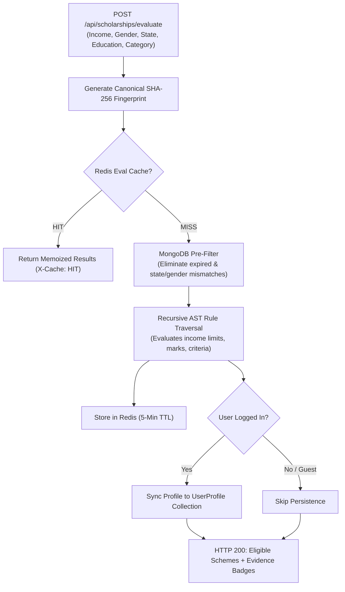

# Udaan Scholarship Finder

[](https://udaan-scholarships.vercel.app/)
[](https://udaan-scholarship-finder.onrender.com)
[](https://nodejs.org/)
[](https://react.dev/)
[](https://www.mongodb.com/)
[](https://redis.io/)
[](https://tailwindcss.com/)

Udaan is an autonomous scholarship intelligence and trust platform built for Indian students. It bridges the gap between decentralized government portals and eligible applicants by continuously crawling statutory circulars, verifying portal legitimacy, auditing document readiness with zero PII storage, evaluating eligibility rules using deterministic Abstract Syntax Trees (ASTs), and dispatching multi-channel deadline countdowns.

---

## Quick Navigation
* [In Plain English: What Problem Does Udaan Solve?](#-in-plain-english-what-problem-does-udaan-solve)
* [System Architecture Diagram](#-system-architecture-diagram)
* [Under the Hood: Simplified Concepts](#-under-the-hood-simplified-concepts)
* [Authentic Tech Stack](#-authentic-tech-stack)
* [Core Engineering Workflows](#-core-engineering-workflows)
* [Directory Layout](#-directory-layout)
* [Getting Started Locally](#-getting-started-locally)

---

## 💡 In Plain English: What Problem Does Udaan Solve?

Every year, thousands of crores in scholarship funds across India go unclaimed, while millions of deserving students either miss application deadlines or fall prey to fraudulent circulars demanding fake processing fees.

**Udaan fixes this in four straightforward steps:**

1. **Autonomous Discovery**: Instead of students manually checking dozens of clunky government and philanthropic websites, Udaan's crawlers automatically inspect official portals (like Tata Trusts, UGC, AICTE) for fresh notifications and deadline updates.
2. **Instant & Private Eligibility Matching**: Students enter their basic education level, category, state, and income. Udaan checks their profile against an exact mathematical rule engine—without AI hallucinations—and tells them instantly which scholarships they qualify for and *why*.
3. **Scam Protection (Trust Shield)**: Students can paste any suspicious scholarship link, WhatsApp forward, or SMS circular into Udaan. The system checks domain authority, gazette registries, and fee demands to warn students before they lose money.
4. **Smart Reminders**: When a student bookmarks a scholarship, Udaan calculates the exact dates for 7-day and 48-hour warnings, queuing automated alerts so they never miss an official cutoff.

---

## 🏗️ System Architecture Diagram

Udaan follows a decoupled, resilient architecture designed for sub-10ms search queries, zero-knowledge privacy, and high-availability background task processing:

```mermaid
flowchart TB
    subgraph ClientTier ["1. Client Tier (Vercel)"]
        SPA["React 19 SPA + Vite"]
        Router["React Router v7 (URL as State)"]
        UI_Components["GSAP Animated UI & Lucide Icons"]
        DocVault["Zero-Knowledge Document Vault (localStorage)"]
        Turnstile["Cloudflare Turnstile Bot Shield"]
    end

    subgraph EdgeTier ["2. Edge & Security Gateway (Render)"]
        ExpressApp["Express 5 REST API"]
        HelmetMW["Helmet Security Headers"]
        RateLimiter["Redis Sliding-Window Rate Limiter"]
        AuthMW["JWT & Google OAuth Verification"]
        MorganLogger["Morgan HTTP Request Logger"]
    end

    subgraph ControllerTier ["3. Application Controllers & Services"]
        ScholarshipCtrl["Scholarship Controller
(Native $text Search)"]
        BookmarkCtrl["Bookmark Controller
(User Saves & Alerts)"]
        ProfileCtrl["Profile Controller
(Demographics & Criteria)"]
        TrustCtrl["Trust Shield Controller
(Domain & Fee Heuristics)"]
        RuleEngine["Deterministic AST Rule Evaluator
(Zero-Hallucination Matching)"]
        EmailSvc["Nodemailer Email Service
(Branded Responsive Templates)"]
    end

    subgraph PersistenceTier ["4. Persistence & Caching Tier"]
        RedisCluster[("Redis Layer
- Fail-Open Cache-Aside
- Deterministic Query Keys
- SHA-256 Eval Fingerprints
- Distributed Locks (Lua)")]
        MongoAtlas[("MongoDB Atlas Cluster
- Scholarships (Compound Text Index)
- User Profiles & Bookmarks
- Audit Logs & Version Diffs")]
        BullMQQueue[("BullMQ Redis Queue
- Delayed Countdown Jobs
- Idempotent Job IDs")]
    end

    subgraph AsyncTier ["5. Autonomous Background Workers"]
        Scheduler["Ingestion Scheduler
(Guarded by Redis Lock)"]
        Crawlers["Cheerio Web Crawlers
(Tata Trusts, UGC, AICTE)"]
        DiffEngine["Diff Engine
(Detects Deadline Mutations)"]
        ReminderWorker["BullMQ Worker Fleet
(Re-verifies DB State at Run Time)"]
    end

    %% Client to Edge
    SPA --> Router
    Router --> ExpressApp
    ExpressApp --> HelmetMW --> RateLimiter --> AuthMW --> MorganLogger

    %% Edge to Controllers
    MorganLogger --> ScholarshipCtrl
    MorganLogger --> BookmarkCtrl
    MorganLogger --> ProfileCtrl
    MorganLogger --> TrustCtrl

    %% Controller Interactions
    ScholarshipCtrl <-->|Cache Hit / Miss| RedisCluster
    ScholarshipCtrl -->|Native $text Search| MongoAtlas
    ScholarshipCtrl --> RuleEngine
    RuleEngine <-->|Memoized SHA-256 Hash| RedisCluster
    BookmarkCtrl --> MongoAtlas
    BookmarkCtrl -->|Schedule 7d / 48h| BullMQQueue
    TrustCtrl --> MongoAtlas

    %% Async & Crawling Flows
    Scheduler -->|Acquire Lock (NX EX)| RedisCluster
    Scheduler --> Crawlers
    Crawlers --> DiffEngine
    DiffEngine -->|Commit Versioned Diff| MongoAtlas
    DiffEngine -.->|SCAN Pattern Eviction| RedisCluster
    BullMQQueue --> ReminderWorker
    ReminderWorker -->|Verify Bookmark Active| MongoAtlas
    ReminderWorker --> EmailSvc
```

---

## 🧠 Under the Hood: Simplified Concepts

To explain this platform during technical interviews or discussions, here are the core architectural decisions translated into simple terms:

### 1. Abstract Syntax Tree (AST) Rule Engine
* **The Analogy**: Like a flowchart converted into code.
* **Why we built it**: Standard `if/else` statements require code updates every time a government portal tweaks an income ceiling. Feeding scholarships into a generic AI LLM causes hallucinations (approving ineligible students).
* **How Udaan does it**: Criteria are stored as nested JSON trees:
  ```json
  {
    "type": "AND",
    "children": [
      { "field": "income", "op": "LTE", "value": 250000 },
      { "field": "gender", "op": "EQ", "value": "female" }
    ]
  }
  ```
  The evaluator traverses this tree mathematically. It produces **100% deterministic results** and outputs an exact checklist of which rules passed and failed.

### 2. Cache-Aside Pattern with Fail-Open Resilience
* **The Analogy**: Checking your quick-access notebook before walking across the building to the library.
* **How Udaan does it**: 
  1. Student searches for scholarships $\rightarrow$ Express checks Redis first.
  2. If found (**Cache Hit**, $<5\text{ms}$), it returns immediately.
  3. If missing (**Cache Miss**), it queries MongoDB Atlas, stores the result in Redis with a TTL, and sends the response.
  4. **Fail-Open Resilience**: If Redis crashes or undergoes maintenance, the system silently catches the error and queries MongoDB directly. The app slows down slightly from $5\text{ms}$ to $60\text{ms}$, but **the user never encounters an HTTP 500 error**.
  5. **Deterministic Keys**: URLs like `?page=1&category=Eng` and `?category=Eng&page=1` are sorted into identical keys so memory is never wasted.

### 3. Delayed Job Queue with BullMQ (No Midnight Polling)
* **The Analogy**: Setting an alarm clock instead of staying awake all night checking your watch.
* **Why not a midnight database cron?**: Scanning thousands of scholarships and bookmarks every midnight creates a massive query spike that slows down the primary database.
* **How Udaan does it**: When a student bookmarks a scholarship, BullMQ calculates the exact millisecond delay until the 7-day and 48-hour cutoff. It places a delayed job into a **Redis Sorted Set (`ZSET`)**. Redis holds the job at zero compute cost until the exact second arrives, then wakes up the worker.
* **Runtime Re-verification**: When the worker wakes up days later, it checks MongoDB: *Has the user unbookmarked it? Did the deadline get extended?* If invalid, it silently drops the job without spamming the student.

### 4. Redis Distributed Locking (Multi-Instance Safety)
* **The Analogy**: The bathroom key at a coffee shop—only one person holds the key at a time.
* **The Problem**: When running multiple instances of the backend on a cloud host (like Render or Kubernetes), each instance has its own background timer. Without coordination, both instances will crawl the web and send duplicate emails simultaneously.
* **How Udaan does it**: Before running a crawler or digest sweep, the worker requests a lock in Redis using an atomic command: `SET lock:crawler:run <UUID> NX EX 300`. Only the winning instance runs the crawl; other instances abort immediately. When finished, an atomic Lua script validates ownership and releases the lock safely.

### 5. Hybrid Cheerio Live Scraping with AST Fallback
* **The Problem**: Government websites frequently change their CSS classes, suffer downtime, or block scrapers. Pure live scraping breaks easily; hardcoded data goes stale.
* **How Udaan does it**: Ingestion adapters (`TataTrustSource`, `UgcSource`) scrape live HTML elements using Cheerio to extract fresh notice URLs, circular titles, and application dates. They merge these live parameters into authoritative AST rule schemas. If the external portal is down, the adapter safely falls back to authoritative feeds without breaking the pipeline.

### 6. Zero-Knowledge Document Vault
* **The Analogy**: Checking your boarding pass at home using a printed checklist without sending a copy to an unknown server.
* **Why it matters**: Storing government certificates (Aadhaar, Income Certificates, Caste certificates) creates massive PII (Personally Identifiable Information) data leak liability.
* **How Udaan does it**: The entire audit engine runs inside the student's browser. Certificate issue dates are evaluated against the statutory Indian fiscal year (April 1 to March 31) purely in client-side `localStorage`. **Zero PII is transmitted to or stored on our servers.**

---

## 🛠️ Authentic Tech Stack

Every technology in this repository serves an explicit, non-redundant architectural purpose:

### Frontend
| Technology | Exact Version | Architectural Purpose |
| :--- | :--- | :--- |
| **React** | `^19.2.7` | Modern component architecture utilizing the latest React 19 rendering pipeline. |
| **Vite** | `^8.1.0` | Lightning-fast build tooling and hot-module replacement (HMR). |
| **Tailwind CSS** | `^4.3.1` | Utility-first responsive design using the modern `@tailwindcss/vite` engine. |
| **GSAP & @gsap/react** | `^3.15.0` | Hardware-accelerated micro-interactions and smooth page transitions. |
| **React Router** | `^7.18.0` | URL-driven state management (keeping filters, search, and pagination in sync with URL queries). |
| **React Turnstile** | `^1.1.5` | Cloudflare Turnstile integration to protect endpoints against bot automated abuse. |
| **Sonner** | `^2.0.7` | Accessible, high-performance toast notifications. |
| **Lucide React** | `^1.21.0` | Clean, lightweight SVG icon system. |
| **Axios** | `^1.18.1` | Promise-based HTTP client with global 401 error interceptors. |

### Backend
| Technology | Exact Version | Architectural Purpose |
| :--- | :--- | :--- |
| **Express** | `^5.2.1` | Next-generation Express 5 REST API gateway with native async error handling. |
| **MongoDB & Mongoose** | `^9.7.3` | Document persistence with compound weighted `$text` search indexes and schema validation. |
| **Redis & ioredis** | `^6.0.0` | In-memory cache-aside, atomic rate limiters, evaluation fingerprinting, and distributed locks. |
| **BullMQ** | `^6.3.4` | High-throughput Redis-backed message queue for delayed deadline reminders. |
| **Nodemailer** | `^10.0.9` | Branded transactional email delivery via production SMTP with development fallback. |
| **Cheerio** | `^1.2.0` | Fast, lightweight server-side DOM parser for extracting notices from government portals. |
| **Playwright** | `^1.61.1` | Headless browser automation for complex dynamic portals requiring JS execution. |
| **PDF-Parse** | `^2.4.5` | Server-side text extraction from official PDF gazette circulars. |
| **Helmet** | `^8.2.0` | Security middleware setting HTTP headers (CSP, HSTS, X-Content-Type-Options). |
| **Morgan** | `^1.11.0` | Structured HTTP request logger for observability and debugging. |
| **JWT & Google Auth** | `^9.0.3` / `^10.9.0` | Dual-tier authentication supporting OAuth 2.0 Google sign-in and signed JWT tokens. |
| **Bcrypt / Bcryptjs** | `^6.0.0` | Salted password hashing for credentials security. |

---

## 🔄 Core Engineering Workflows

### A. Full-Text Search & Relevance Ranking
```mermaid
sequenceDiagram
    autonumber
    actor User as Student
    participant API as Express API
    participant Cache as Redis (Cache-Aside)
    participant DB as MongoDB Atlas

    User->>API: GET /api/scholarships?search=girl+child&category=Engineering
    API->>Cache: Check Key: scholarship:list:category=Engineering&search=girl+child
    alt Cache HIT (< 5ms)
        Cache-->>API: Return Cached JSON Payload
        API-->>User: HTTP 200 (Header: X-Cache: HIT)
    else Cache MISS
        Cache-->>API: Null
        API->>DB: Native $text: { $search: "girl child" } + Filters
        Note over DB: Evaluates Weighted Index:
Title (10), Org (6), Tags (5), Cat (3)
Projects { score: { $meta: "textScore" } }
        DB-->>API: Relevance-Sorted Documents & Total Count
        API->>Cache: SETEX key 1800 (Save with TTL)
        API-->>User: HTTP 200 (Header: X-Cache: MISS)
    end
```

### B. Eligibility Evaluation with SHA-256 Fingerprint Caching


### C. Bookmark Toggle & Delayed Deadline Alerts
```mermaid
sequenceDiagram
    autonumber
    actor User as Student
    participant API as Bookmark Controller
    participant DB as MongoDB Atlas
    participant Queue as BullMQ Reminder Queue
    participant Worker as BullMQ Worker Fleet
    participant Email as Nodemailer SMTP

    User->>API: POST /api/bookmarks/:scholarshipId
    API->>DB: Toggle Bookmark Record (Upsert)
    API->>Queue: Calculate & Enqueue 7-Day Delay Job
    API->>Queue: Calculate & Enqueue 48-Hour Delay Job
    Note over Queue: Deduplication Guard:
jobId = reminder_userId_scholarshipId_window_deadline
    API-->>User: HTTP 200 (Bookmarked & Alerts Scheduled)

    Note over Queue: Time passes... (7 Days before deadline)
    Queue->>Worker: Dispatch Job (sendDeadlineReminder)
    Worker->>DB: Re-verify State (Is bookmark active? Did deadline change?)
    alt Verified Active
        Worker->>Email: Render Branded HTML & Dispatch via SMTP
        Email-->>User: Delivered to Student Mailbox
        Worker->>DB: Record NotificationLog (SUCCESS)
    else Bookmark Removed / Scheme Expired
        Worker->>Worker: Drop Job (Prevent Spam)
    end
```

---

## 📂 Directory Layout

```
udaan-scholarship-finder/
├── backend/
│   ├── src/
│   │   ├── config/              # MongoDB connection & segregated Redis/BullMQ clients
│   │   ├── controllers/         # REST API endpoints (auth, bookmarks, profile, scholarship, trust)
│   │   ├── engine/              # Deterministic AST rule evaluator & condition resolvers
│   │   ├── ingestion/           # Autonomous crawlers (TataTrustSource, UgcSource, AicteSource, diffEngine)
│   │   ├── jobs/                # Background notification & digest schedulers
│   │   ├── middlewares/         # Auth (JWT), Cache-aside, Rate-limiter (Redis), Error handling
│   │   ├── models/              # Mongoose schemas (Scholarship, Version, User, Profile, Bookmark, Log)
│   │   ├── queues/              # BullMQ queue instances and reminder helpers
│   │   ├── routes/              # Express route declarations with RBAC protection
│   │   ├── scripts/             # Automated test suites & verification utilities
│   │   │   ├── sendTestEmail.js            # Live SMTP email dispatcher & HTML previewer
│   │   │   ├── testFlowFixes.js            # Automated verification for flows A through E
│   │   │   └── testArchitecturalUpgrades.js # Verification for locks, scraping & fan-out
│   │   ├── services/            # Transactional email, notification fan-out, and trust heuristics
│   │   ├── utils/               # Atomic Redis distributed locks (SET NX EX + Lua script)
│   │   └── workers/             # Asynchronous BullMQ deadline countdown workers
│   ├── server.js                # Express application entrypoint (Helmet, Morgan, CORS)
│   ├── package.json             # Pure MongoDB + Redis dependency stack
│   └── .env                     # Server, database, Redis, and SMTP configuration
├── frontend/
│   ├── src/
│   │   ├── assets/              # Branding assets, typography, and illustration graphics
│   │   ├── components/          # EvidenceModal, NotificationCenter, Navbar, Footer, TrustBadge
│   │   ├── context/             # AuthContext with persistent state and 401 token invalidation
│   │   ├── hooks/               # Custom hooks for debounce, media queries, and cache polling
│   │   ├── layouts/             # MainLayout with responsive navigation drawers
│   │   ├── pages/               # Home, Scholarships, Eligibility, TrustShield, DocumentVault, Settings
│   │   ├── services/            # Axios API wrappers (scholarshipService, authService, bookmarkService)
│   │   ├── utils/               # Date helpers, fiscal year auditors, currency formatters
│   │   ├── App.jsx              # Application router & routes declaration
│   │   └── main.jsx             # React 19 root mounting point
│   ├── vite.config.js           # Vite configuration with Tailwind CSS v4 plugin
│   └── package.json             # Frontend dependency manifest
└── README.md                    # System architecture, documentation, and operational guide
```

---

## 🚀 Getting Started Locally

### Prerequisites
* **Node.js**: `v18.0.0` or higher
* **MongoDB**: A local instance or free MongoDB Atlas cluster connection string
* **Redis**: (Optional) A local Redis server or Redis Cloud instance. *If Redis is not installed, the backend automatically runs in fail-open in-memory mode.*

### 1. Clone the Repository
```bash
git clone https://github.com/sanskriti49/udaan-scholarship-finder.git
cd udaan-scholarship-finder
```

### 2. Configure Backend Environment
Create a file named `.env` inside `backend/`:
```env
PORT=5000
NODE_ENV=development
MONGO_URI=your_mongodb_connection_string
JWT_SECRET=your_jwt_secret_key_min_32_chars
FRONTEND_URL=http://localhost:5173

# Redis Configuration (Optional: fails open if unavailable)
REDIS_HOST=127.0.0.1
REDIS_PORT=6379

# Transactional Email (Optional: runs in simulated fallback mode if empty)
SMTP_HOST=smtp.gmail.com
SMTP_PORT=587
SMTP_USER=your_email@gmail.com
SMTP_PASS=your_gmail_app_password
EMAIL_FROM="Udaan Scholarship Finder" <your_email@gmail.com>
```

### 3. Run Backend Automated Verification Tests
You can run our automated test suites to verify that search indexing, eligibility evaluation, distributed locking, and live scraping are working properly:
```bash
# 1. Test Core Flows (Search, Eligibility, Ingestion, Bookmarks, Security)
node backend/src/scripts/testFlowFixes.js

# 2. Test Architectural Upgrades (Distributed Locks, Cheerio Scraping, Fan-out)
node backend/src/scripts/testArchitecturalUpgrades.js

# 3. Test Email UI Delivery (Dispatches real email to your inbox & saves local HTML preview)
node backend/src/scripts/sendTestEmail.js your_email@gmail.com INSTANT_MATCH
```

### 4. Start the Application
```bash
# Terminal 1: Start Backend
cd backend
npm install
npm run dev

# Terminal 2: Start Frontend
cd frontend
npm install
npm run dev
```
Open [http://localhost:5173](http://localhost:5173) in your browser to explore Udaan.

---

## 📄 License & Mission
Built for student empowerment, equity, and fraud prevention across India. All statutory gazette references belong to their respective government ministries and issuing authorities.
